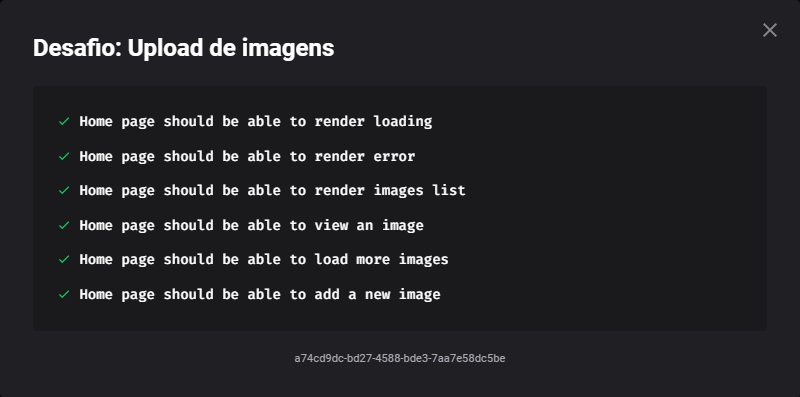

<h1 style="background:#1a1d23; padding: 2rem 0;" align="center">
  
</h1>

<h1 align="center">
    UpFi
</h1>
<p align="center">Carregue e compartilhe suas imagens.</p>

<p align="center">
 <a href="#sobre-o-projeto">Sobre o Projeto</a> •
 <a href="#tecnologias">Tecnologias</a> •
 <a href="#iniciando-o-projeto">Iniciando o projeto</a> •
 <a href="#licença">Licença</a> •
 <a href="#autor">Autor</a>
</p>

## Sobre o projeto

O projeto tem como objetivo o estudo e desenvolvimento de uma aplicação em ReactJS com NextJS realizando o upload de imagens para o [ImgBB](https://imgbb.com/) utilizando uma interface construida inteiramento com [Chakra](https://chakra-ui.com/) com validação de formulário com [React Hook Form](https://react-hook-form.com/) e para armazenamento serverless [FaunaDB](https://fauna.com/).

---

## Tecnologias

Abaixo as tecnologias utilizadas para construção da aplicação

- [ReactJS](https://reactjs.org/)
- [NextJS](https://nextjs.org/)
- [TypeScript](https://www.typescriptlang.org/)
- [Chakra](https://chakra-ui.com/)
- [FaunaDB](https://fauna.com/)
- [ImgBB](https://imgbb.com/)
- [React Hook Form](https://react-hook-form.com/)

---

## 🏃🏾 Testes

Para estar completo, o projeto deve passar pelos seguintes testes quando é entregue na plataforma da rocketseat:

- [x] Home page should be able to render loading
- [x] Home page should be able to render error
- [x] Home page should be able to render images list
- [x] Home page should be able to view an image
- [x] Home page should be able to load more images
- [x] Home page should be able to add a new image

Resultado do Projeto:

 

### **Iniciando o projeto**

```bash

# Clone this project
$ git clone https://github.com/MauricioAires/ignite-template-reactjs-upload-de-imagens

# access
$ cd ignite-template-reactjs-upload-de-imagens

# Install dependencies
$ yarn install

# Na raiz do projeto crie uma copia do arquivo .env.local.example
# Altere o nome da copia para .env.local
# Preencha as variáveis ambiente de acordo com as instruções
$ cp .env.example .env.local

# config NEXT_PUBLIC_IMGBB_API_KEY
https://api.imgbb.com/

# config FAUNA_API_KEY
https://dashboard.fauna.com/keys/@db/global/seu-projeto

# Run the project
$ yarn dev

# The server will initialize in the <http://localhost:3000>

```

---

## Licença

Distribuído sob a licença MIT. Veja [LICENSE](LICENSE) para mais informações.

---

## Autor

Feito por Mauricio Aires 👋🏽
